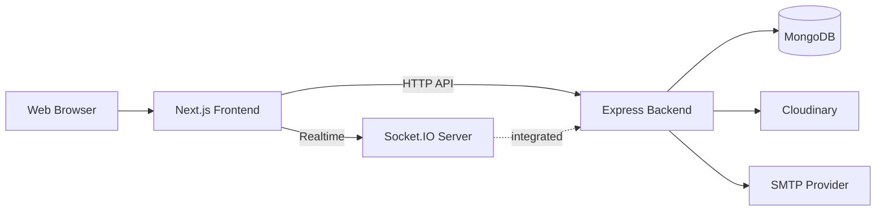
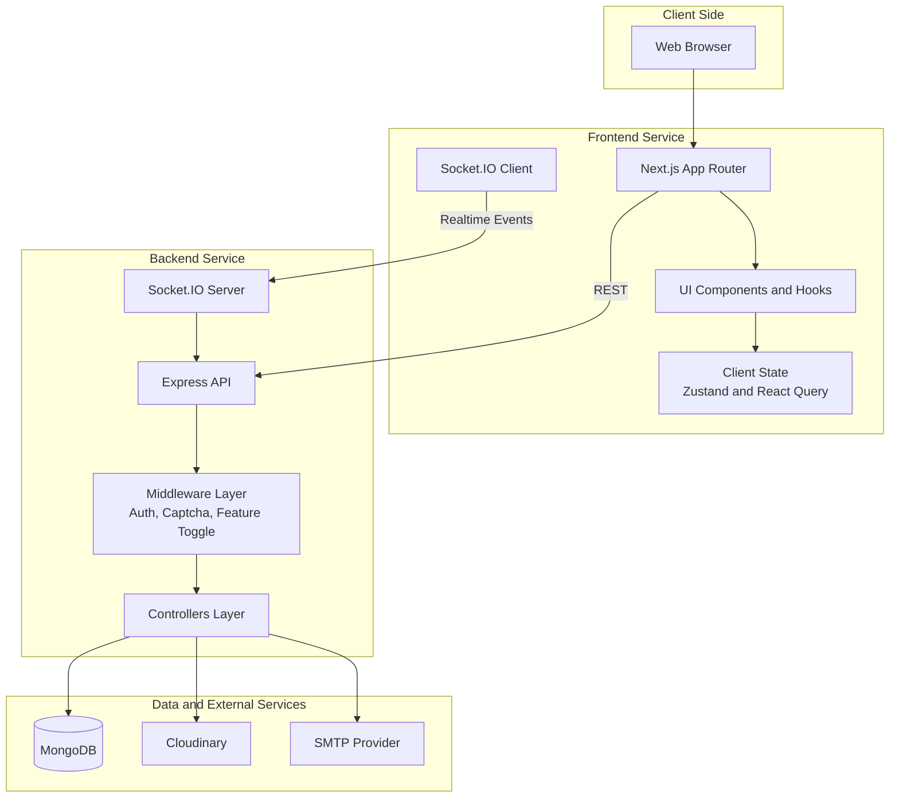
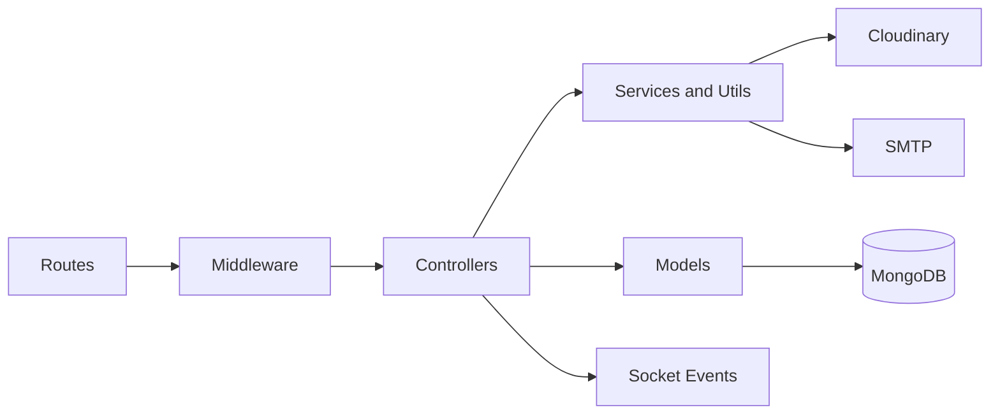
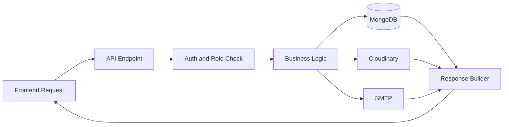
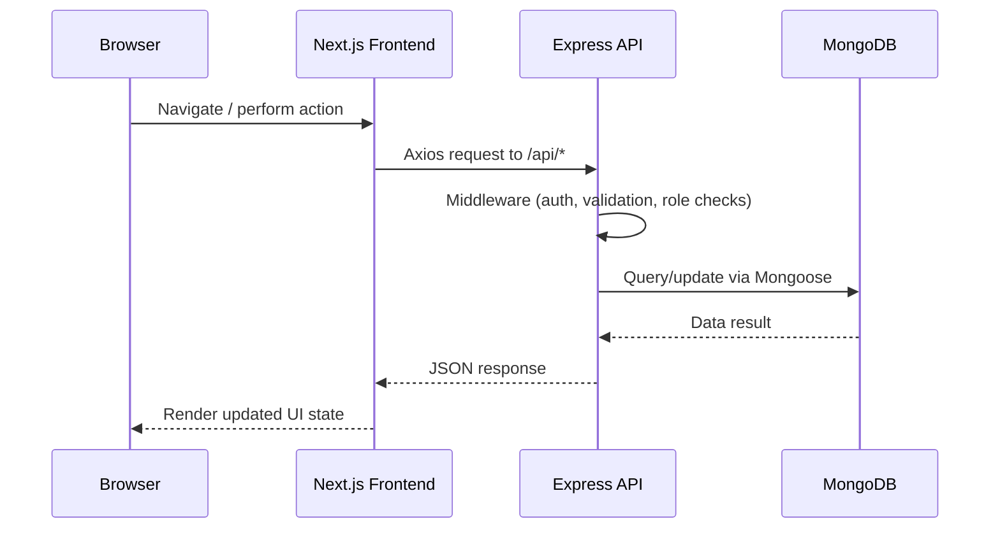
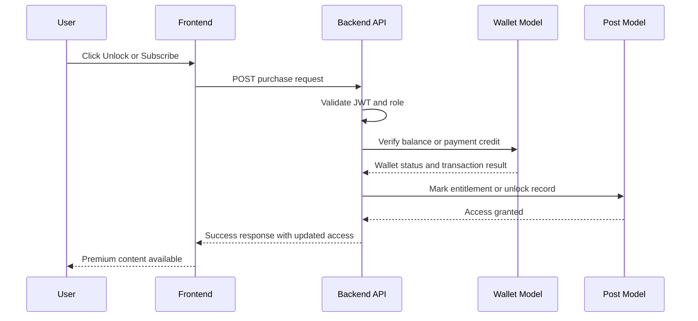
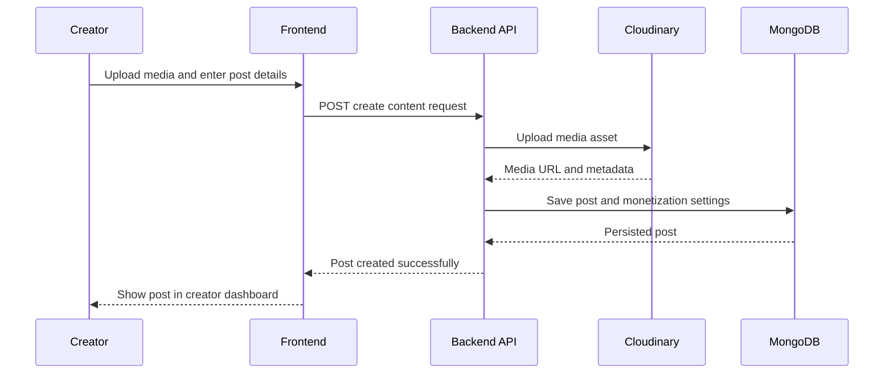
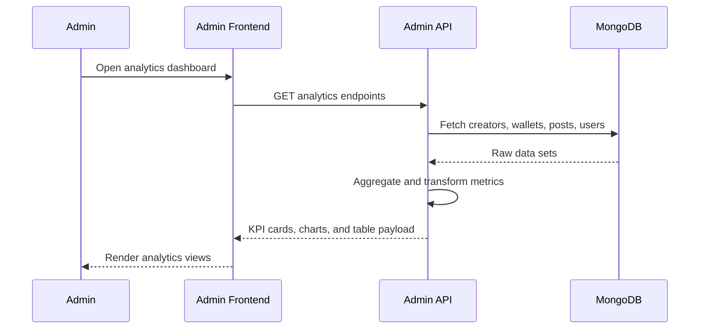

# CreatorHub

CreatorHub is a full-stack creator economy platform where creators can publish premium content, users can purchase/unlock content, and admins can manage the platform through analytics and moderation tools.

This repository contains:
- A Next.js frontend app with user, creator, admin, wallet, moderation, and support experiences.
- An Express + MongoDB backend API with JWT auth, Socket.IO, Cloudinary uploads, and role-based routes.

## 1) Product Vision

CreatorHub is designed to support a complete creator-to-fan ecosystem:
- Creators publish content, run subscriptions, and track performance.
- Fans discover creators, subscribe, buy content, and interact.
- Admins monitor platform health, revenue, moderation, and support workflows.

## 2) Core Feature Set

### User Features
- Authentication and profile management
- Creator discovery and profile browsing
- Content purchase and wallet flows
- Purchase history and notifications
- Messaging and interactions

### Creator Features
- Creator dashboard and analytics
- Content publishing and post performance
- Subscriber and earnings tracking
- Insights for audience and monetization

### Admin Features
- Platform dashboard and KPIs
- Creator analytics and revenue analytics
- User/admin management
- Platform settings and controls

### Platform/Ops Features
- Moderation module (reports, bans, notifications)
- Support tickets and user support workflows
- Real-time features via Socket.IO

## 3) High-Level Architecture

CreatorHub follows a modular monorepo-style structure with separated frontend and backend apps.



### 3.1 Container Architecture (Detailed)



### 3.2 Backend Component Diagram



### Runtime Components
- Frontend: Next.js (App Router), React, TypeScript, component-driven UI
- Backend: Node.js, Express, Mongoose, JWT auth, Socket.IO
- Database: MongoDB
- Media: Cloudinary
- Email: SMTP (for auth and communication flows)

## 4) Repository Structure

```text
.
|- backend/
|  |- config/            # DB + socket config
|  |- controllers/       # API business logic by domain
|  |- middleware/        # auth/captcha/feature gating
|  |- models/            # Mongoose models
|  |- routes/            # API route groups
|  |- utils/             # cloudinary, tokens, security settings
|  \- server.js          # API + Socket.IO entrypoint
|
|- frontend/
|  |- app/               # Next.js app router pages
|  |- src/               # shared components, hooks, store, lib
|  |- AdminManagement/   # admin management domain module
|  |- Moderation/        # moderation domain module
|  |- SupportTickets/    # support ticket domain module
|  |- UserSupport/       # user support domain module
|  \- UserWallet/        # wallet domain module
|
\- opencode.json
```

## 5) System Design Overview

### 5.0 Design Principles
- Domain-oriented module boundaries for scalability
- Backend as source of truth for transactional and analytics data
- Stateless API auth via JWT
- Realtime communication over Socket.IO for event-driven UX
- Clear separation between rendering layer, API layer, and persistence layer

### 5.1 API Layer
- REST-style endpoints mounted under `/api/*`.
- Main backend route groups:
  - `/api/auth`
  - `/api/user`
  - `/api/creator`
  - `/api/admin`
  - `/api/livestream`
  - `/api/moderation`
  - `/api/admin-management`
  - `/api/support`
  - `/api/support/user`

### 5.2 Domain Modeling (MongoDB)
- User/Creator identity and role models
- Monetization entities: Wallet, Post, subscription/payment metadata
- Social entities: Comment, Reaction, Message, Notification, Review
- Operational entities: moderation/admin/support models

### 5.3 Realtime Design
- Socket.IO server is attached to the same HTTP server in `backend/server.js`.
- Frontend connects via `NEXT_PUBLIC_SOCKET_URL`.
- Used for realtime communication scenarios (chat/livestream events/notifications depending on route usage).

### 5.4 Security Design
- JWT-based authentication middleware for protected APIs
- Role-based authorization (user/creator/admin)
- Captcha middleware (Turnstile variables supported)
- Centralized token generation and auth interceptors on frontend

### 5.5 Data and Media Flow
- App data is persisted in MongoDB through Mongoose models.
- User-uploaded media is managed via Cloudinary.
- Email actions (verification/reset flows) go through SMTP.

### 5.6 Data Flow Diagram



### 5.7 Key Domain Workflows
- User purchase flow: browse -> checkout -> wallet transaction -> unlock content
- Creator publishing flow: upload -> metadata persist -> visibility and monetization rules
- Admin analytics flow: aggregate metrics -> transform -> dashboard visualization

## 6) Tech Stack

### Frontend
- Next.js 16
- React 19
- TypeScript
- Tailwind CSS
- Axios
- React Query
- Zustand
- React Hook Form + Zod
- Recharts
- Socket.IO client

### Backend
- Node.js
- Express
- Mongoose
- JWT
- Socket.IO
- Cloudinary
- Nodemailer

### Infrastructure/Services
- MongoDB
- Cloudinary
- SMTP provider

## 7) Environment Variables

Create env files for frontend and backend before running.

### Backend (`backend/.env`)

Required:
- `MONGODB_URI`
- `JWT_SECRET`

Common/Recommended:
- `PORT` (default in code: `5002`)
- `FRONTEND_URL` (for CORS and auth links)
- `CLOUDINARY_CLOUD_NAME`
- `CLOUDINARY_API_KEY`
- `CLOUDINARY_API_SECRET`
- `SMTP_HOST`
- `SMTP_PORT`
- `SMTP_USER`
- `SMTP_PASS`
- `SMTP_FROM`
- `CONVERSATION_ENCRYPTION_SECRET`
- `TURNSTILE_SITE_KEY`
- `TURNSTILE_SECRET_KEY`

### Frontend (`frontend/.env.local`)

Required:
- `NEXT_PUBLIC_API_URL` (example: `http://localhost:5002/api`)

Optional/Common:
- `NEXT_PUBLIC_SOCKET_URL` (example: `http://localhost:5002`)
- `NEXT_PUBLIC_TURNSTILE_SITE_KEY`

Additional module-specific values exist in domain modules (moderation/admin-wallet/support), for example:
- `ADMIN_ROLE`
- `BCRYPT_SALT_ROUNDS`
- custom collection names for moderation/support modules

## 8) Local Development Setup

## Prerequisites
- Node.js 20+
- npm 10+
- MongoDB instance

## Install Dependencies

From repository root:

```bash
cd backend
npm install

cd ../frontend
npm install
```

## Run Development Servers

Terminal 1:

```bash
cd backend
npm run dev
```

Terminal 2:

```bash
cd frontend
npm run dev
```

Default URLs:
- Frontend: `http://localhost:3000`
- Backend API: `http://localhost:5002`

Note: frontend API default fallback in code points to port `5000`. Set `NEXT_PUBLIC_API_URL=http://localhost:5002/api` to match backend default.

## 9) Build and Production Run

### Backend

```bash
cd backend
npm run start
```

### Frontend

```bash
cd frontend
npm run build
npm run start
```

## 10) Seed and Bootstrapping

Backend scripts:
- `npm run seed`
- `npm run seed:admin`

Use these to bootstrap initial datasets/admin records where required.

## 11) Request/Response Lifecycle (Simplified)



## 11.1 Workflow Diagrams

### A) User Purchase and Content Unlock Workflow



### B) Creator Publish Workflow



### C) Admin Analytics Workflow



## 12) Module Boundaries and Ownership Ideas

The codebase is organized by business domains. This makes it easier to assign ownership:
- Auth/User domain
- Creator domain
- Admin analytics/operations domain
- Moderation and Trust/Safety domain
- Support and ticketing domain
- Wallet/payments domain

Recommended ownership model:
- One maintainer or squad per domain folder
- Shared frontend platform squad for `frontend/src/*`
- Shared backend platform squad for `backend/config`, `backend/middleware`, and security utilities

## 13) Architecture Decisions (Current)

- Monorepo with separate deployment units (`frontend` + `backend`)
- Backend is source of truth for analytics/transactional data
- JWT for stateless auth on API routes
- Socket server colocated with API server for simpler local/early-stage deployment
- Domain modules in frontend include their own MVC-like structures for scalability

## 14) Non-Functional Considerations

### Scalability
- Separate frontend/backend services already enable independent scaling.
- Mongo collections and analytics endpoints should be indexed/optimized as data grows.
- Socket.IO can be moved to a dedicated realtime service when load increases.

### Reliability
- Add centralized error monitoring and request tracing in production.
- Add health endpoints and startup readiness checks.

### Security
- Enforce strong JWT secret in production.
- Restrict CORS to trusted frontend origins.
- Keep Cloudinary/SMTP credentials in secret manager, never commit env files.

### Observability
- Add structured logging and correlation IDs.
- Add metrics for auth failures, API latency, websocket connections, and payment flows.

## 15) Testing and Quality Strategy (Recommended)

Current scripts are focused on lint/build and runtime. For robust quality gates, add:
- Backend unit and integration tests (controllers/routes/middleware)
- Frontend component and page tests
- API contract tests for key endpoints (`/auth`, `/wallet`, `/creator`, `/admin`)
- End-to-end smoke tests for auth, purchase, and dashboard flows

## 16) Deployment Blueprint (Recommended)

- Deploy frontend and backend as separate services.
- Set environment variables per environment (dev/stage/prod).
- Use managed MongoDB.
- Serve media via Cloudinary CDN.
- Configure SMTP and domain-level email sender policies (SPF/DKIM/DMARC).

## 17) Roadmap Ideas

- Payment gateway abstraction for multiple providers
- Event-driven analytics pipeline for heavy dashboard workloads
- Fine-grained role/permission matrix
- Audit logs and admin action trails across all modules
- Multi-tenant support for creator organizations
- Recommendation engine for creator discovery

## 18) Contribution Guide

1. Create a feature branch.
2. Keep changes scoped to a domain/module.
3. Validate local runs for both backend and frontend.
4. Open a pull request with:
   - Problem statement
   - Change summary
   - Screenshots for UI updates
   - Notes on env/config changes

## 19) Troubleshooting

### Frontend cannot reach backend
- Verify backend is running.
- Check `NEXT_PUBLIC_API_URL` points to backend port (default backend here is `5002`).

### Auth seems unstable on client
- Confirm JWT secret consistency in backend env.
- Clear local storage token and re-login.

### Upload issues
- Verify Cloudinary env values are set correctly.

### Email not sending
- Validate SMTP host/port/user/pass and sender configuration.

## 20) Project Naming

Project name for documentation and product identity is set to:

**CreatorHub**
